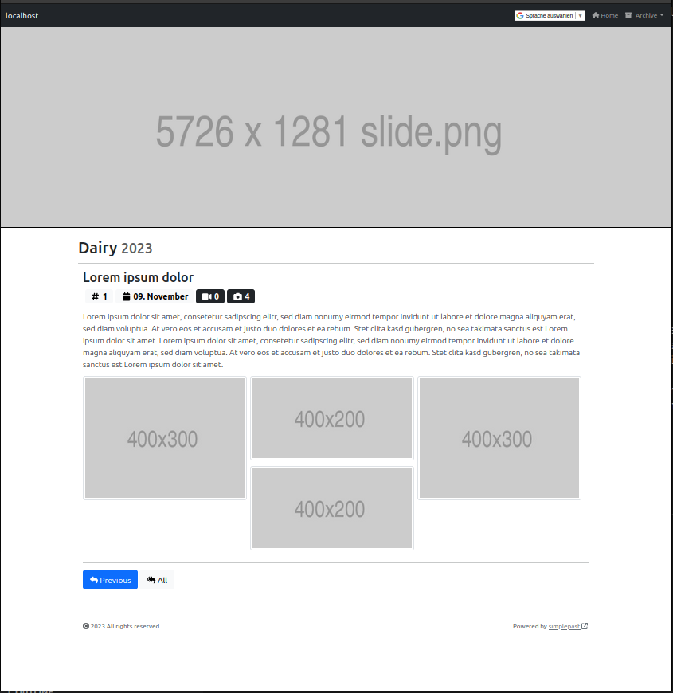

# SimplePast


`SimplePast` is a HTML/CSS/JavaSript based framework to publish a weblog on the World Wide Web.

It comes with a CLI called `articlectl` to create file based news posts.

> 

## Features

The intention to implement `SimplePast` was to have a weblog that is easy to maintain and to setup. Further it should be able to run for months/years without relevant need for changes. This is achieved by:

- Lean architecture to apply KISS.
- Convention-over-configuration to keep configuration simple.
- Relying on containerized infrastructure to isolate the framework and package all requirements.
- File based storage to avoid database maintenance.
- Vanilla JavaScript and no external JS frameworks to keep the dependencies low. 
- A handfull of freely available (MIT licensed) libraries to not reinvent the wheel.
- Semantic Versionning to enable a transparent release process.

## How it Works

`SimplePast` publishes text entries (articles) together with multimedia files such as images and/ or videos. Articles are displayed in reverse chronological order so that the most recent post appears first, at the top of the web page. Articles are grouped in years.

`SimplePast` runs in a Docker container, based on Caddy webserver. It mounts a configuration file to set up properties and an `article` folder that contains all postings.

JavaScript is executed on the client side, only. The client requests meta information from the server. This information is made available via JSON files. 

## Basic Usage

Steps, to configure and run `SimplePast`:

1. Create a configuration file to set up `SimplePlast`:

   ```shell
   $ wget https://raw.githubusercontent.com/suckowbiz/simplepast/main/blueprints/config.json
   ```

1. Create a local file storage as a root for articles. Consider current year as initial article folder:

   ```shell
   $ mkdir --parent articles/$(date +"%Y")
   ```

1. Bootstrap the first article to have content to display:

   ```shell
   # Consider current uid and gid to set the ownership of new files to current user.
   $ docker run \
       --tty \
       --user $(id -u):$(id -g) \
       --volume $PWD/articles:/articles \
       suckowbiz/articlectl bootstrap /articles/$(date +"%Y")/1
   
   $ .
     └── articles
         └── 2023
             └── 1
                 ├── content.txt
                 ├── date.txt
                 ├── heading.txt
                 ├── img
                 └── vid
   ```

1. Provide news content to customize the bootstrapped article:

   ```shell
   $ vi articles/$(date +"%Y")/1/content.txt
   $ vi articles/$(date +"%Y")/1/heading.txt
   # (optional) place images into articles/$(date +"Y")/1/img/
   # (optional) place video(s) into articles/$(date +"Y")/1/vid/
   ```

1. Use `articlectl` to create thumbnails and resize images of the created article.

    ```shell
    $ docker run \
        --tty \
        --user $(id -u):$(id -g) \
        --volume $PWD/articles:/articles \
        suckowbiz/articlectl mogrify /articles/$(date +"%Y")/1
    ```

1. Run `SimplePast` to publish the created article:

   ```shell
   # This example follows the basic Caddy example as of https://hub.docker.com/_/caddy.
   $ docker run \
       --rm \
       --name simplepast \
       --publish 80:80 \
       --volume $PWD/articles:/usr/share/caddy/articles \
       --volume $PWD/config.json:/usr/share/caddy/config.json \
       suckowbiz/simplepast
   ```

1. Visit: `https://localhost`

## Customization

## (Caddy) Webserver Configuration

The `SimplePlast` Dockerfile is directly inheriting the official Caddy Dockerfile. Thus all options/examples of the official Caddy Dockerfile apply. See [https://hub.docker.com/_/caddy](https://hub.docker.com/_/caddy) for configuration options.

### SimplePast Configuration

The configuration options are:

| Option | Description | Example |
| ------ | ----------- | ------- |
| `archiveStart` | The first entry for the drop down list to switch the year. It will be filled in until the current year is reached. | 2022 |
| `btnAllTitle` | Title of the button to load all articles of the current year. | "All" |
| `btnPrevTitle` | Title of the button to load a previous article. | "Next" |
| `copyright` | Your copyright information. | "All rights reserved." |
| `googleSiteVerification` | Google site verification content to verify ownership of a site. | "loremipsum" |
| `linkArchiveTitle` | Title of the dropdown list to switch the year | "Archive" |
| `linkHomeTitle` | Title of the text link to jump to the start page. | "Home" |
| `pageHeading` | Frontpage heading. | "Dairy" |
| `pageTitle` | HTML title of the webpage. | "My newsblog" |

### Frontpage Banner

Replace the default frontpage banner with a new one to customize it. It is assumed the new banner image is located at `./banner.png`:

```shell
$ docker run -p 80:80 \
    --volume $PWD/articles:/usr/share/caddy/articles \
    --volume $PWD/config.json:/usr/share/caddy/config.json \
    --volume $PWD/banner.png:/usr/share/caddy/banner.png \
    suckowbiz/simplepast
```

### Google Site Verification

E.g. to verify ownership of a domain, Google requires a HTML site. SimplePast support verification meta tag. It can be configured with the `SimplePast` config option: `googleSiteVerificationContent`.

## 3rd Party Software

SimplePast uses third party libraries to provide a web GUI:

- [Twitter Bootstrap](https://getbootstrap.com/) as frontend toolkit.  
  License: [MIT](https://github.com/twbs/bootstrap/blob/main/LICENSE)
- [Fontawesome](https://fontawesome.com/) as icon library.  
  License: [Free License](https://fontawesome.com/license/free)
- [masonry](https://github.com/desandro/masonry) for cascading grid layout.  
  License: [MIT](https://desandro.mit-license.org/)
- [imagesloaded](https://github.com/desandro/imagesloaded) to detect when images have been loaded.  
  License: [MIT](https://desandro.mit-license.org/)
- [PhotoSwipe](https://github.com/dimsemenov/photoswipe) as lightbox.  
  License: [MIT](https://github.com/dimsemenov/PhotoSwipe/blob/master/LICENSE)

## SimplePast License

`SimplePast` is licensed under MIT license.
