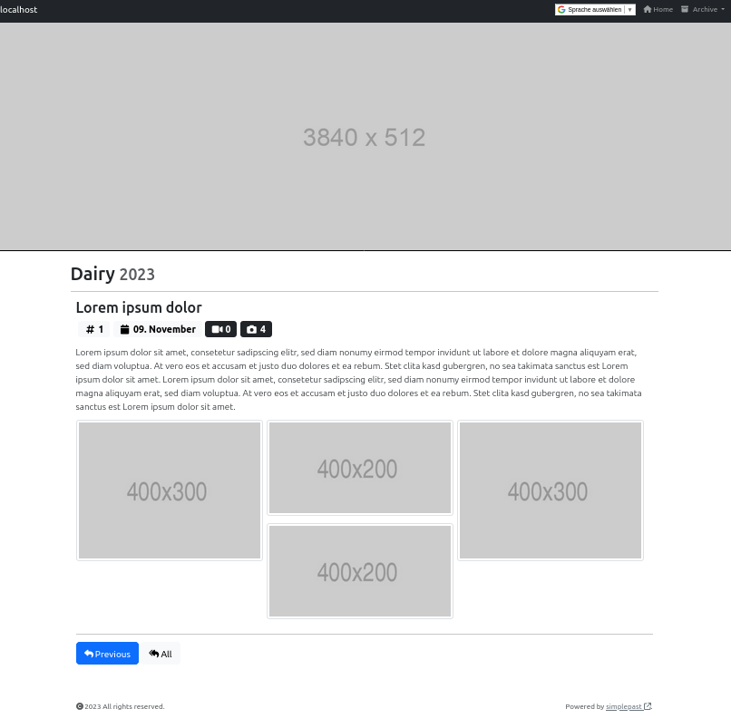

# SimplePast

`SimplePast` is a HTML/CSS/JavaSript based framework to publish a weblog on the World Wide Web.

It comes with a CLI called `articlectl` to create file based news posts.



## Features

The intention to implement `SimplePast` was to have a weblog that is easy to maintain and to setup. Further it should be able to run for months/years without relevant need for changes. This is achieved by:

- Lean architecture to apply KISS.
- Convention-over-configuration to keep configuration simple.
- Relying on containerized infrastructure to isolate the framework and package all requirements.
- File based storage to avoid database maintenance.
- Vanilla JavaScript and no external JS frameworks to keep the dependencies low. 
- A handfull of freely available (MIT licensed) libraries to not reinvent the wheel.
- Semantic Versionning to enable a transparent release process.

## How it Works

`SimplePast` publishes text entries (articles) together with multimedia files such as images and/ or videos. Articles are displayed in reverse chronological order so that the most recent post appears first, at the top of the web page. Articles are grouped in years.

`SimplePast` runs in a Docker container, based on Caddy webserver. It mounts a configuration file to set up properties and an `article` folder that contains all postings.

JavaScript is executed on the client side, only. The client requests meta information from the server. This information is made available via JSON files. 

## Basic Usage

Steps:

1. Create a configuration file to set up `SimplePlast`:

   ```
   wget https://github.com/suckowbiz/simplepast/blob/main/blueprints/config.json
   ```

1. Create a local file storage as a root for articles:

  ```shell
  mkdir -p $PWD/articles/2023
  ```

1. Bootstrap the first article to have content to display:

  ```shell
  ```

1. Run `SimplePast` to serve content:

```shell
$ docker run -p 80:80 \
		-v $$PWD/articles:/usr/share/caddy/articles \
		-v $$PWD/config.json:/usr/share/caddy/config.json \
		-v $$PWD/banner.png:/usr/share/caddy/banner.png \
		suckowbiz/simplepast
```

TBD.

`docker run --rm -p 80:80 suckowbiz/simplepast:main`

## Configuration

Any configuration is based on a single configuration file. A blueprint is located at `./blueprints/config.json`.

```json
{
    "pageTitle": "",
    "pageHeading": "",
    "copyright": "",
    "archiveStart": 0,
    "btnPrevTitle": "",
    "btnAllTitle": "",
    "linkHomeTitle": "",
    "linkArchiveTitle": ""
}
```

The configuration options are:

| Option | Description | Example |
| ------ | ----------- | ------- |
| `pageTitle` | HTML title of the webpage. | "My newsblog" |
| `pageHeading` | Frontpage heading. | "Dairy" |
| `copyright` | Your copyright information. | "All rights reserved." |
| `archiveStart` | The first entry for the drop down list to switch the year. It will be filled in until the current year is reached. | 2022 |
| `btnPrevTitle` | Title of the button to load a previous article. | "Next" |
| `btnAllTitle` | Title of the button to load all articles of the current year. | "All" |
| `linkHomeTitle` | Title of the text link to jump to the start page. | "Home" |
| `linkArchiveTitle` | Title of the dropdown list to switch the year | "Archive" |

## Articles

TBD.

## 3rd Party Software

SimplePast uses third party libraries to provide a GUI. All of them are free to use.

- [Twitter Bootstrap](https://getbootstrap.com/) as frontend toolkit.  
  License: [MIT](https://github.com/twbs/bootstrap/blob/main/LICENSE)
- [Fontawesome](https://fontawesome.com/) as icon library.  
  License: [Free License](https://fontawesome.com/license/free)
- [masonry](https://github.com/desandro/masonry) for cascading grid layout.  
  License: [MIT](https://desandro.mit-license.org/)
- [imagesloaded](https://github.com/desandro/imagesloaded) to detect when images have been loaded.  
  License: [MIT](https://desandro.mit-license.org/)
- [PhotoSwipe](https://github.com/dimsemenov/photoswipe) as lightbox.  
  License: [MIT](https://github.com/dimsemenov/PhotoSwipe/blob/master/LICENSE)

## License

`SimplePast` is licensed under MIT license.
